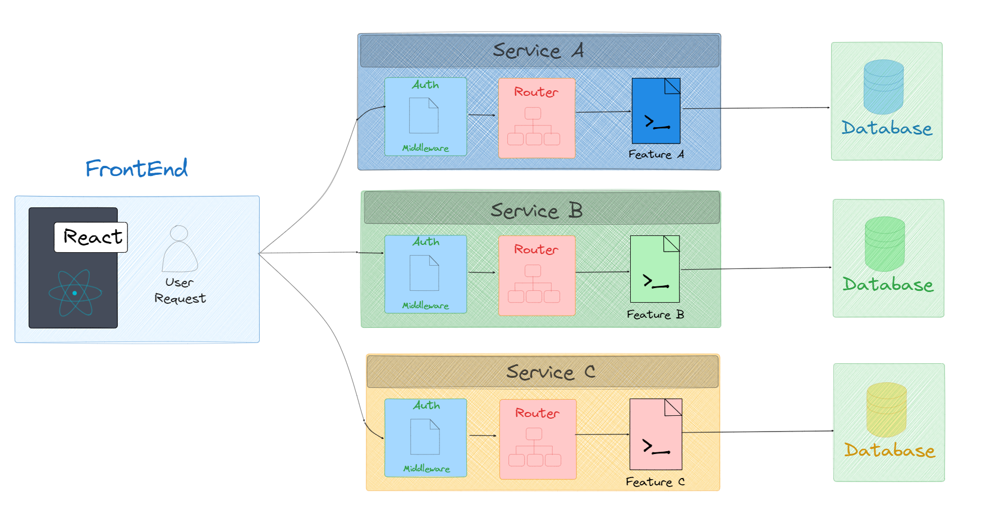

<h1 align="center"> Mini-microservice-Project-using-React</h1>
<div align="center" >
 <a  href="https://d1deobiyy57tb2.cloudfront.net">
        Preview Site
    </a>
</div> 
<h1>Welcome</h1>

# IMPORTANT !

Reload the page to see your post, same goes for the comments, once you submit your comment pls reload the page and you will see it.

If you want to know more about the project, inside of each carpet there is a .md document, there you can check the process and steps.

It's still in process but i was finally able to full deploy it in AWS services.

The Client Front end part is hosted in S3, it's deployed as static app.

For the post and comments microservices i use Lambda serverles and then set Api Gateway as triggers.

<h2>How to use it</h2>

In the Web home page you will see a navbar in the top side (is not responsive yet), in the top right part there is button that you can click and it will show you a front where you can create your post.

# Coming up:

Dark and light mode would be able to use for any user and user id, login per session will generate a temporary user token.

# Next features:

Currently working in a Websocket service for the comments and posts as well.


# Why did i use microservices architecture for this project?

<div align="center" >
<h2> Monolithic server</h2>

</div>

An average server host all the features in its core base, since the auth token per user and the path where to send the request data, then go through the feature to finally reach the database with all the data's user that would write or read (in this project will be both), after the first `POST` request it returns to the user which `GET` the request data, so the `Monolithic` server contains the routing, the middleware and database access. If for some reason the post's feature crash down, the whole server it would be as well.


<div align="center" >
<h2> Microservices performance</h2>

</div>

In the other hand we have the microservices, the microservices allow keeping our app running even if for some reason one of the features crash down or just disappear, since each service gets its own database it doesn't matter if this happens, (actually it does matter xd) because my app will still be running.

So the advantage is that a single microservice contains the same as monolithic contains, but per feature, in this project there are two features one is `Posts` and the other one is `Comments` both of then use a Api rest built in Express.js to POST and GET the data's user (Temporary).

# LOGBOOK


Install dependencies
`npm i`


Kubeadm is a tool that helps us ``bootstrap`` a Kubernetes cluster. Kubelet is an agent that runs on each node and communicates with the master node. Kubectl is a command-line tool that allows us to interact with the cluster.


https://medium.com/@ajitfawade/how-to-deploy-a-microservices-application-on-aws-ec2-using-kubernetes-a-step-by-step-guide-63b845544d39

t2.medium instances:
https://aws.amazon.com/es/ec2/instance-types/t2/

https://www.educative.io/answers/what-is-kubernetes-cluster-what-are-worker-and-master-nodes

https://platzi.com/discusiones/1787-spa-javascript/87515-strongayudastrong-el-comando-npm-run-build-no-me-genera-el-archivo-indexhtml-dentro-de-la-carpeta-dist-me-genera-la-carpeta-dist-2/

https://dev.to/adetutu/setting-up-a-react-project-with-vite-a-step-by-step-guide-329k

https://www.digitalocean.com/community/tutorials/nodejs-serving-static-files-in-express


- The concept of Terminating an EC2 instance is completely different from stopping them. Terminating is when you don’t need an instance and want to delete it completely from your AWS infrastructure which cannot be recovered. However, if you have an AWS snapshot, you can create an AWS AMI that will enable you to restore an instance to the date when you created the snapshot.

https://www.nops.io/how-to-delete-terminated-ec2-instances-in-aws/#:~:text=To%20delete%20terminated%20EC2%20Instances%2C%20locate%20the%20instance%20you%20want,Click%20%E2%80%9CYes%E2%80%9D%20to%20confirm.

`it's more complicated than i thought` :c


# How to deploy Express server on AWS lambda

-install dependencies
`npm i serverless-http`

-import serverless

`const serverless = require("serverless-http");`

-I need to add a handler at the bottom to export  my app wrapped in the serverless function

`module.exports.handler=serverless(app);`

-Remove app-listen because it won't work

```js
/*
app.listen(4000,()=>{
    console.log('Listening at post 4000');
})
*/
```
- The base route won't work when the app it's deployed in Lambda Function

- Go to Lambda web service
https://aws.amazon.com/lambda/

- Create Function

- Upload zip file of my code

-Once is submitted i need to ad a trigger

-Trigger Api Gateway

-Create Rest Api > Create Resource > Configure as Proxy request

-Proxy resource it will forward the request to my lambda function

- Proxy resources handle requests to all sub-resources. To create a proxy resource use a path parameter that ends with a plus sign, for example {proxy+}.

`Proxy resources handle requests to all sub-resources. To create a proxy resource use a path parameter that ends with a plus sign, for example {proxy+}.`

https://docs.aws.amazon.com/apigateway/latest/developerguide/http-api-develop-routes.html

#Bucket policy

The bucket policy, written in JSON, provides access to the objects stored in the bucket. Bucket policies don't apply to objects owned by other accounts.


Static website hosting

-Enable


- Allows Permissions

Bucket Policy

